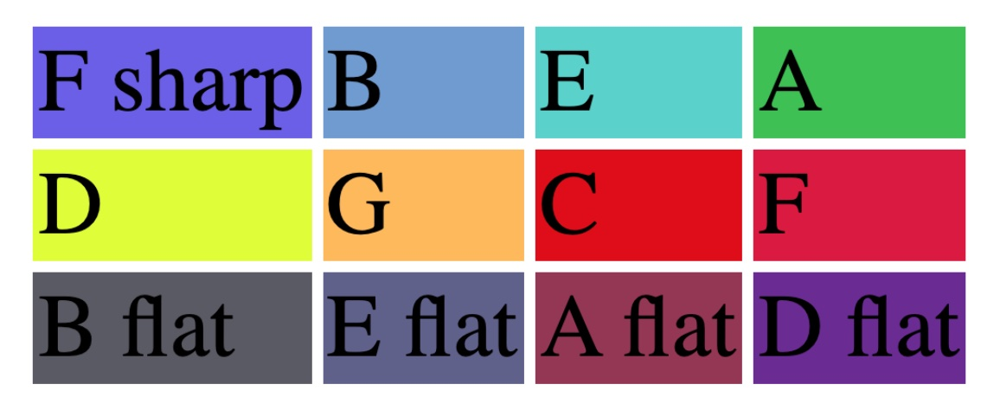

In April 2022 Martin Kaptein finished his Master's Thesis and Research at the *Fontys* Conservatory of Tilburg, The Netherlands.
The topic of the presentation was *Colors in Alexander Scriabin’s Sonata No.8 Op.66: Exploring the relation between color and harmony in Scriabin’s music*.
This can be described as the first step to revolutionize the perception of music, with wide-ranging effects for piano performance practice, music education and audience perception.

You can [read the full Master Thesis here (PDF)](/files/martin_kaptein-scriabin-colors-in-sonata-8.pdf).

## Watch the presentation

Martin also [recorded a summary of the research](https://www.youtube.com/watch?v=DfBFm_D1EzM) as a screencast presentation.

<iframe width="560" height="315" src="https://www.youtube.com/embed/DfBFm_D1EzM" title="YouTube video player" frameborder="0" allow="accelerometer; autoplay; clipboard-write; encrypted-media; gyroscope; picture-in-picture" allowfullscreen></iframe>
