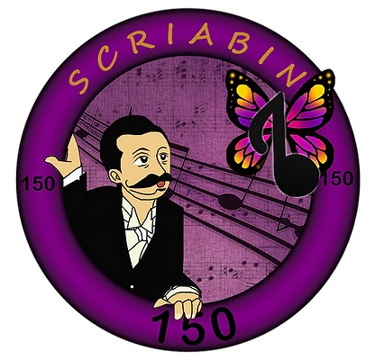
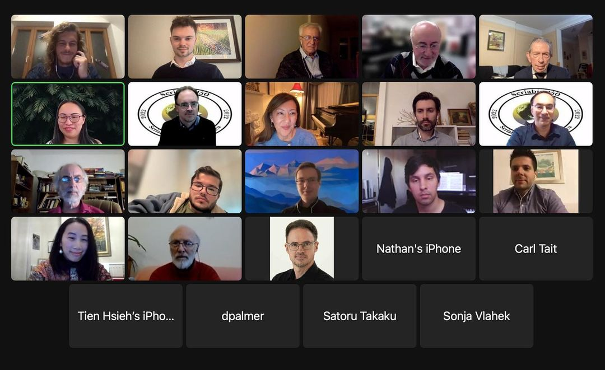
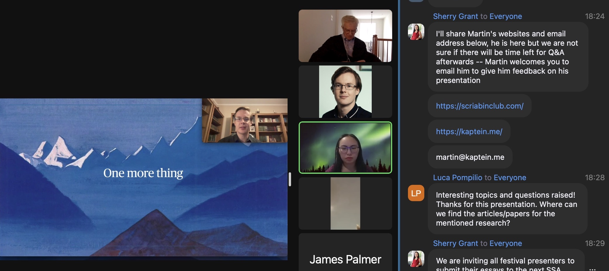

From 11th until 13th of November 2022 the [international online Scriabin 150 Festival](https://www.artsinfinitypress.com/scriabin150) took place, in collaboration with many fantastic people and musicians.
Every day, from 10am until 6pm (ET), interesting lectures, presentations and talks took place via the Zoom online platform.

This Event was possible due to collaboration with [the Scriabin Society of America](https://scriabinsociety.com/).

## Look back

In the following a few pictures and impressions from the festival.

*All participants*

*Martin's presentation*
