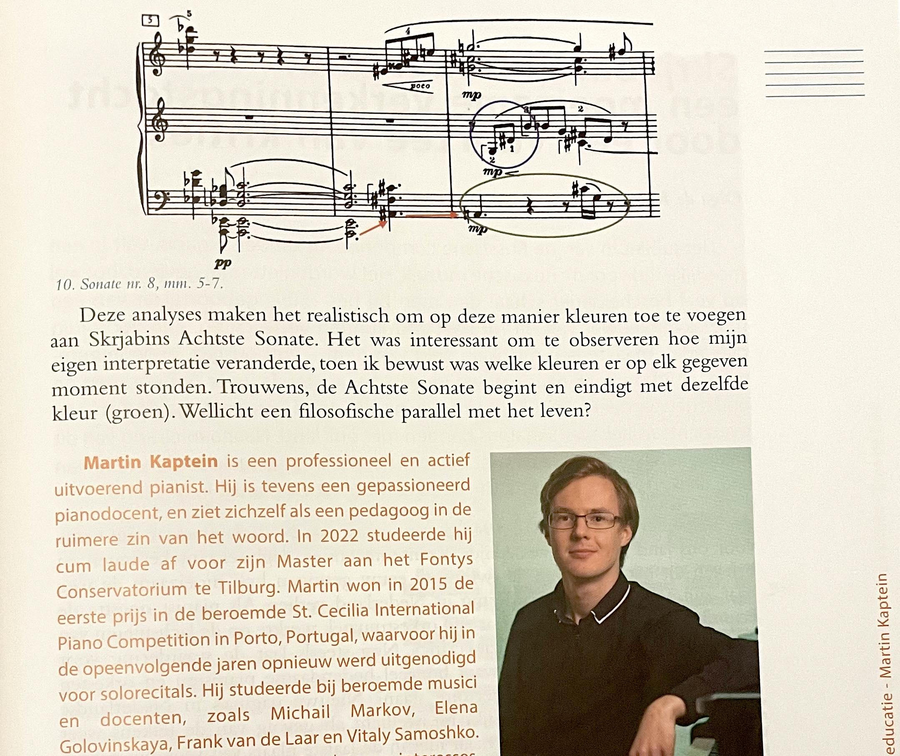

Martin Kaptein published an article about the synaesthesia of the Russian composer Alexander and its **practical uses in the field of education**.
This article was published in the [117th editition](https://eptanederland.nl/piano-bulletin/117-2022-3/) of the Dutch-Language Paper *Piano Bulletin*.
*Piano Bulletin* is part of **EPTA** (European Piano Teachers Association).

You can find [the full article (Dutch) here (scan)](epta-article.pdf).

This dutch article is based on [Martin's Master Thesis (English)](/news/2022/research/) with the title: *Colors in Scriabin’s Sonata No.8: Exploring the relation between color and harmony in Scriabin’s music*.

