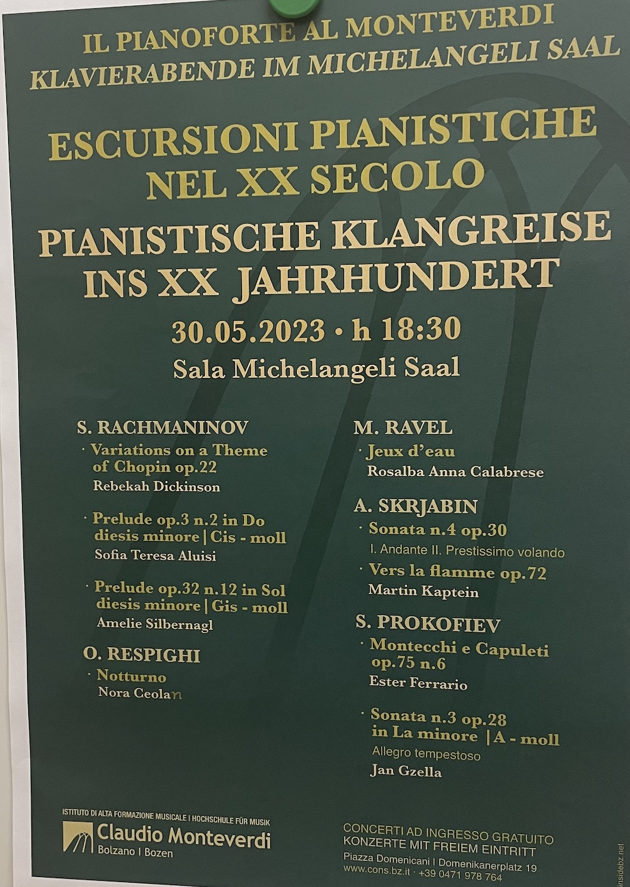
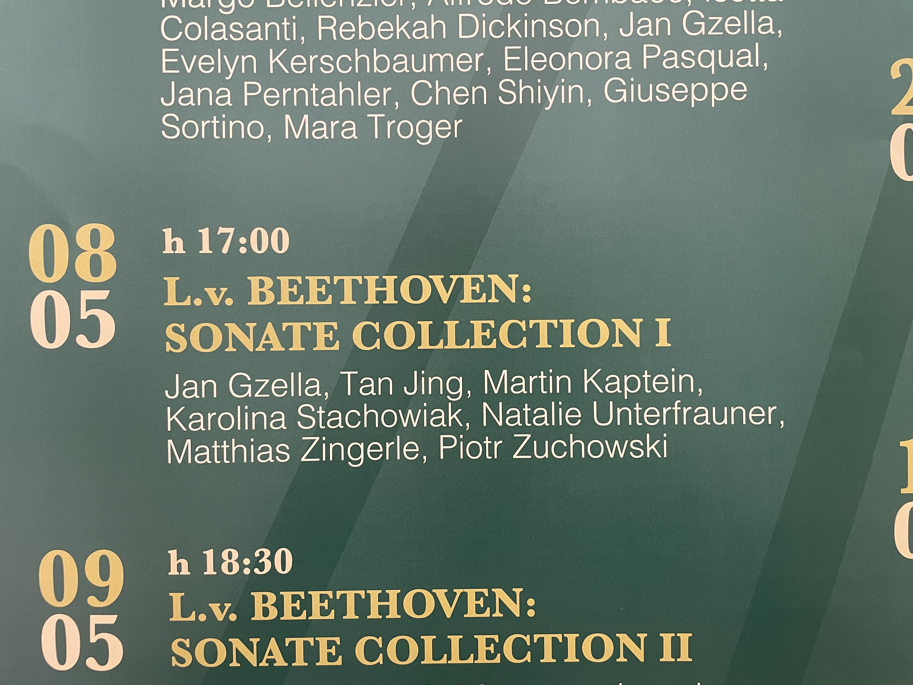

*(This page is regularly being updated with the latest information.)*

## 30 May 2023

On 30th of May Martin performs several works by A.Scriabin.
The concert starts 18:30 in the Michelangeli Hall of the conservatory of Bolzano, Italy (*Piazza Domenicani 19, 39100 Bolzano (BZ), Italy*).

*Scriabin Concert Poster*

## 9 May 2023

On 9th of May 2023 there will be a performance of Pyotr Ilyich Tchaikovsky's Trio in A minor, Op. 50, with Martin Kaptein performing the Piano Part.
The concert starts at 12:00 in the Michelangeli Hall of the conservatory of Bolzano, Italy (*Piazza Domenicani 19, 39100 Bolzano (BZ), Italy*).

<video width="320" height="240" controls> <source src="/images/tchaikovsky-trio.mp4" type="video/mp4">Your browser does not support the video tag.</video>

## 8 May 2023

On the 8th of May 2023 there will a project dedicated to the composer L.v.Beethoven.
It will feature a showcase of Beethoven sonata's.
Martin Kaptein takes part in this project by performing the Sonata Op.28 by Beethoven.

This Event starts at 17:00 on 8 May 2023, in the Michelangeli Hall of the conservatory of Bolzano, Italy.
 The address of the conservatory is: Piazza Domenicani 19, 39100 Bolzano (BZ), Italy.

## 25 March 2023

On the 25th of March 2023 there will be a concert featuring Martin Kaptein in the city of Bolzano, Italy. The concert will take place in the Circolo Cittadino in the centre of Bolzano and commence at 19:00. On the program there are works by Beethoven, Scriabin, Chopin and Debussy.
