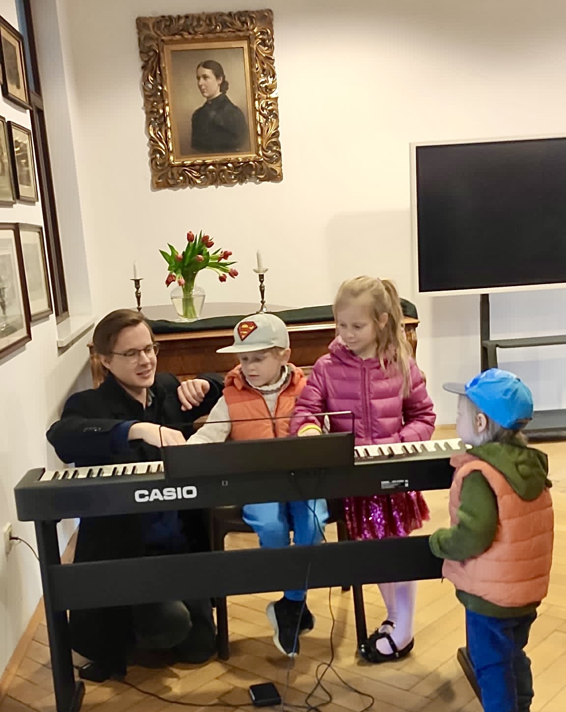
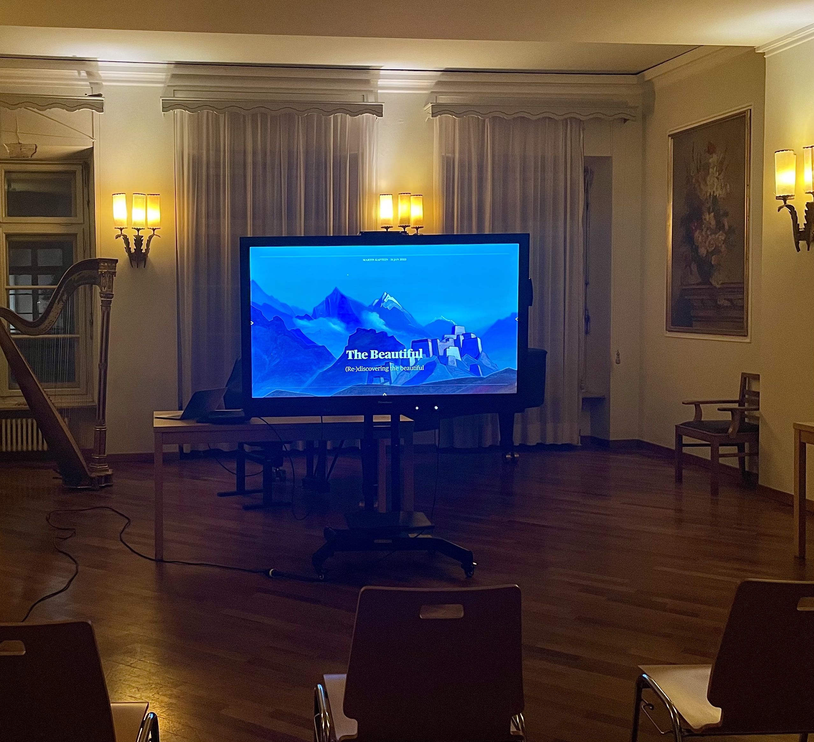

[Online piano and music theory lessons](/online-lessons/)

[Books and Philosophy](/books/)

[Technology and IT experience](/tech/)

Martin Kaptein is a true Renaissance man, with a deep curiosity about the world and a desire to explore all that it has to offer.
For him it is a very important mission to share his knowledge and experience with the world.
On this page you will find more information about the fields Martin educates in.
Feel free to [contact Martin](/contact/) for any requests or inquiries.

## Music

Martin Kaptein is a qualified [classical pianist](/piano/) and music teacher.
Martin has a extensive private piano practice and has a lot of experience teaching in music schools and substituting teachers in conservatories in the Netherlands and Italy.

Martin has a special approach to teaching, which has proven to be highly effective.
This approach is based on Martin's knowledge of Eastern Philosophies, guaranteeing a intuitive and natural approach to learning technique and musicality.
Martin [teaches students of all ages](/online-lessons), and currently teaches many children.

## Lecturing

Martin regularly holds physical and [online lectures and presentations](https://youtube.com/playlist?list=PLJHAmFz9mLV9GxR_I8Z4lN9T3A9A3b_bU) on a wide range of topics, including but not limited to: Piano practice, Music exploration, Philosophy, Technology and IT, History of Art.

## Languages

Martin is fluent in English, German, Dutch and Russian.
These are his mother-, father- and childhood languages.
Additionally Martin is familiar with French and Italian.
Currently Martin learns Chinese (Mandarin).

Martin's approach to language teaching has been greatly influenced by the *Michel Thomas Method*.

## Culture and Philosophy

Martin comes from a multicultural background, and knows a [wide and diverse range of philosophies](/books/).
He has a lot of practical life experience and likes to share it.

## Technology

Martin likes Technology and IT and [regularly posts about various topics in his blog](/blog/).
This often includes tutorials and step-by-step guides.
Martin also has worked in the fields of IT Administration.
[See Martin's technology CV](/tech/) for more information.
